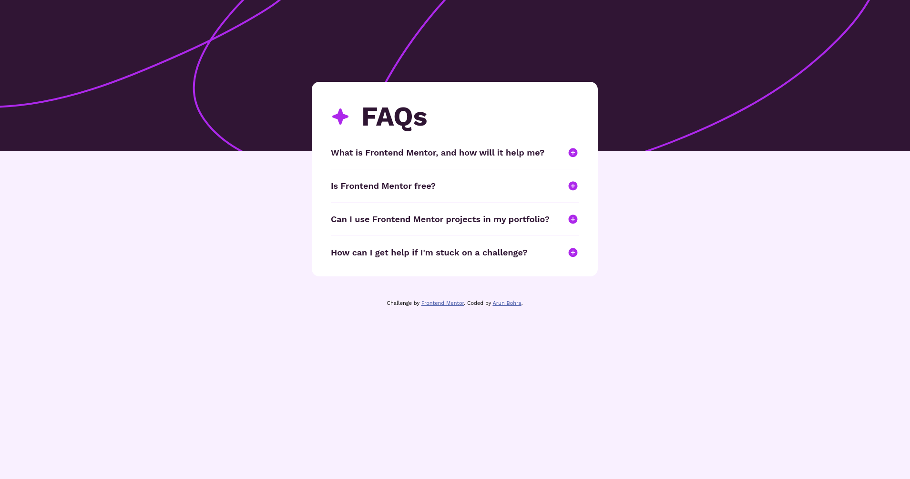

# Frontend Mentor - FAQ accordion

This is a solution to the [FAQ accordion challenge on Frontend Mentor](https://www.frontendmentor.io/challenges/faq-accordion-wyfFdeBwBz). Frontend Mentor challenges help you improve your coding skills by building realistic projects.

## Overview

### The challenge

Users should be able to:

- Hide/Show the answer to a question when the question is clicked
- Navigate the questions and hide/show answers using keyboard navigation alone
- View the optimal layout for the interface depending on their device's screen size
- See hover and focus states for all interactive elements on the page

### Screenshot

### Links

- Solution URL: [GitHub](https://github.com/ArunBohra12/faq-accordion-component)
- Live Site URL: [Netlify](arun-faq-accordion-component.netlify.app)

## My process

### Built with

- HTML
- CSS
- Typescript
- Jest - Testing library

### What I learned

- Learned about the accessibility, concerns for keyboard users and user who depend on voice
- Learned about writing tests

## Author

- Website - [Arun Bohra](https://arun-bohra.com)
- Frontend Mentor - [@ArunBohra12](https://www.frontendmentor.io/profile/ArunBohra12)
- Twitter - [@ArunBohra122](https://www.twitter.com/ArunBohra122)
